# Sequence Diagram

A tool for creating sequence diagrams from a Domain-Specific Language.

[See it in action!](https://davidje13.github.io/SequenceDiagram/)

This project includes a web page for editing the diagrams, but the core
logic is available as a component which can be
[included in other projects](https://davidje13.github.io/SequenceDiagram/library.htm).

## Examples

### Simple Usage

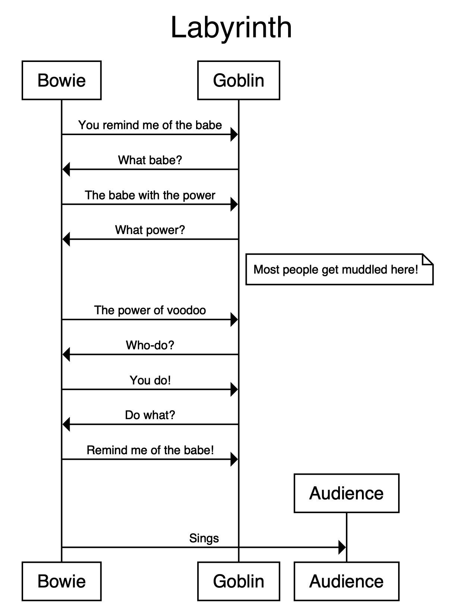

```
title Labyrinth

Bowie -> Goblin: You remind me of the babe
Goblin -> Bowie: What babe?
Bowie -> Goblin: The babe with the power
Goblin -> Bowie: What power?
note right of Bowie, Goblin: Most people get muddled here!
Bowie -> Goblin: "The power of voodoo"
Goblin -> Bowie: "Who-do?"
Bowie -> Goblin: You do!
Goblin -> Bowie: Do what?
Bowie -> Goblin: Remind me of the babe!

Bowie -> Audience: Sings

terminators box
```

### Connection Types

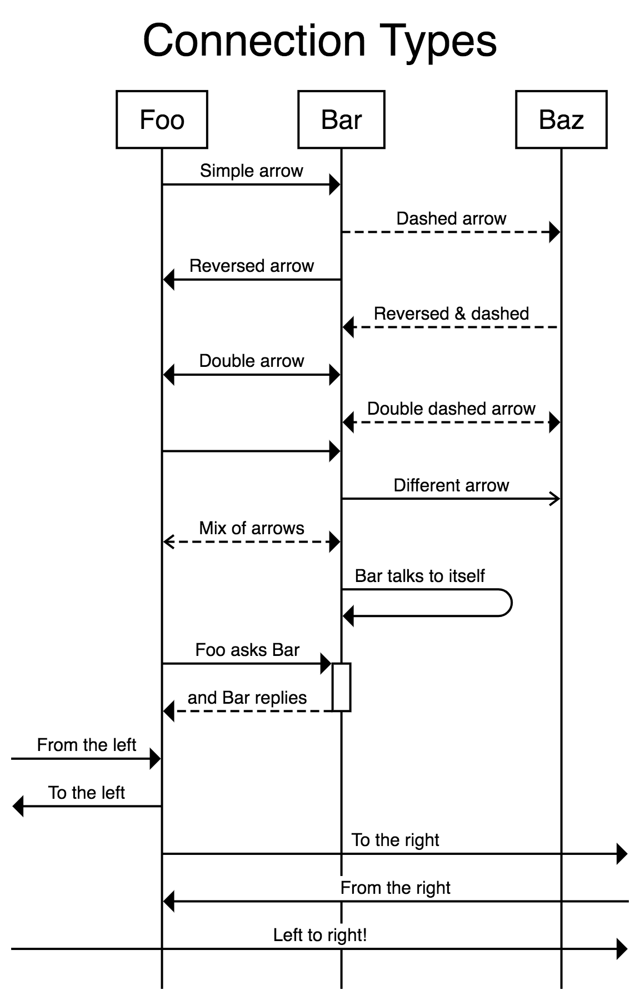

```
title Connection Types

begin Foo, Bar, Baz

Foo -> Bar: Simple arrow
Bar --> Baz: Dashed arrow
Foo <- Bar: Reversed arrow
Bar <-- Baz: Reversed & dashed
Foo <-> Bar: Double arrow
Bar <--> Baz: Double dashed arrow

# An arrow with no label:
Foo -> Bar

Bar ->> Baz: Different arrow
Foo <<--> Bar: Mix of arrows

Bar -> Bar: Bar talks to itself

Foo -> +Bar: Foo asks Bar
-Bar --> Foo: and Bar replies

Bar -x Baz: Lost message

# Arrows leaving on the left and right of the diagram
[ -> Foo: From the left
[ <- Foo: To the left
Foo -> ]: To the right
Foo <- ]: From the right
[ ~> ]: Wavy left to right!
# (etc.)
```

### Dividers


```
title Dividers

begin Foo, Bar, Baz

Foo -> +Bar

divider

Bar -> +Baz

divider delay: This takes a while

-Baz --> Bar

divider tear with height 20: Lots of stuff happens

-Bar --> Foo
```

### Notes & State

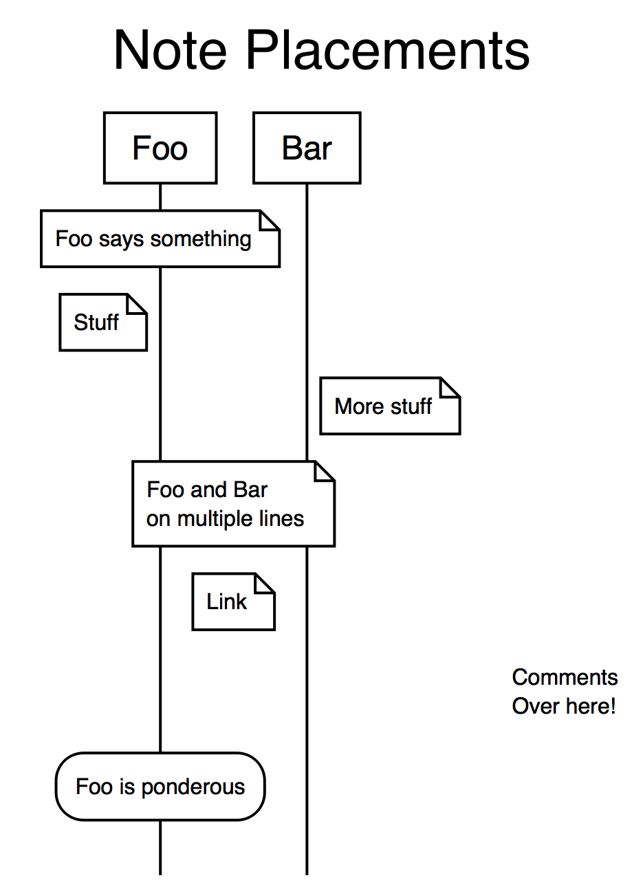

```
title Note Placements

note over Foo: Foo says something
note left of Foo: Stuff
note right of Bar: More stuff
note over Foo, Bar: "Foo and Bar
on multiple lines"
note between Foo, Bar: Link

text right: "Comments\nOver here!"

state over Foo: Foo is ponderous
```

### Logic


```
title At the Bank

begin Person, ATM, Bank
Person -> ATM: Request money
ATM -> Bank: Check funds
if fraud detected
  Bank -> Police: "Get 'em!"
  Police -> Person: "You're nicked"
  end Police
else if sufficient funds
  ATM -> Bank: Withdraw funds
  repeat until "all requested money
                has been handed over"
    ATM -> Person: Dispense note
  end
else
  ATM -> Person: Error
end
```

### Label Templates

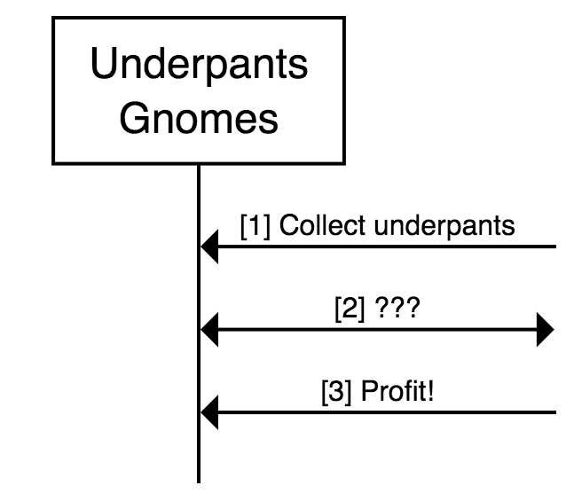

```
autolabel "[<inc>] <label>"

begin "Underpants\nGnomes" as A
A <- ]: Collect underpants
A <-> ]: ???
A <- ]: Profit!
```

### Multiline Text

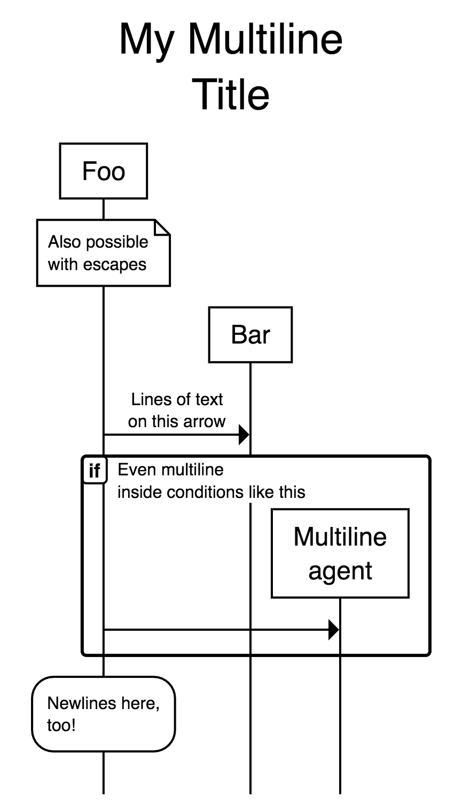

```
title "My Multiline
Title"

begin Foo, Bar

note over Foo: "Also possible\nwith escapes"

Foo -> Bar: "Lines of text\non this arrow"

if "Even multiline\ninside conditions like this"
  Foo -> "Multiline\nagent"
end

state over Foo: "Newlines here,
too!"
```

### Themes

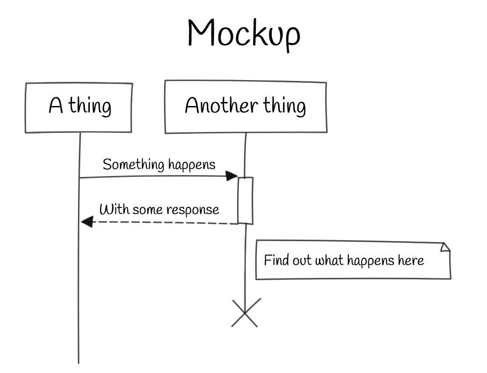

```
theme sketch

title Mockup

A thing -> +Another thing: Something happens
-Another thing --> A thing: With some response
note right of Another thing: Find out what happens here
end Another thing
```

### Short-Lived Agents

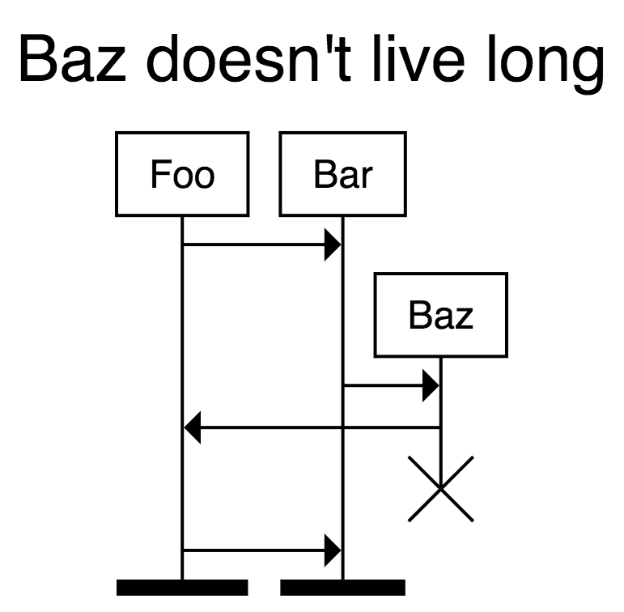

```
title "Baz doesn't live long"

note over Foo, Bar: Using begin / end

begin Baz
Bar -> Baz
Baz -> Foo
end Baz

note over Foo, Bar: Using * / !

# * and ! cause agents to be
# created and destroyed inline
Bar -> *Baz: make Baz
Foo <- !Baz: end Baz

# Foo and Bar end with black bars
terminators bar
# (options are: box, bar, cross, fade, none)
```

### Agent Aliases

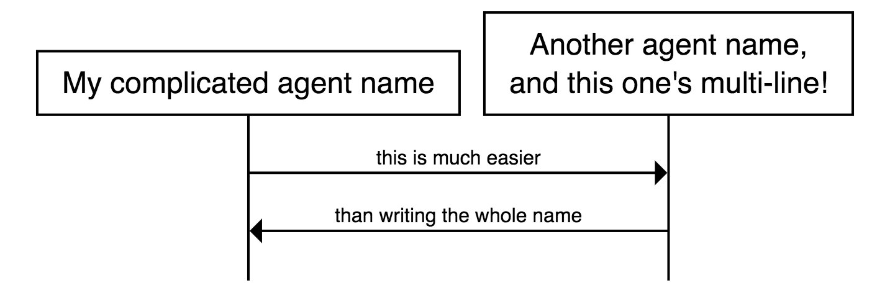

```
define My complicated agent name as A
define "Another agent name,
and this one's multi-line!" as B

A -> B: this is much easier
A <- B: than writing the whole name
```

### Markdown

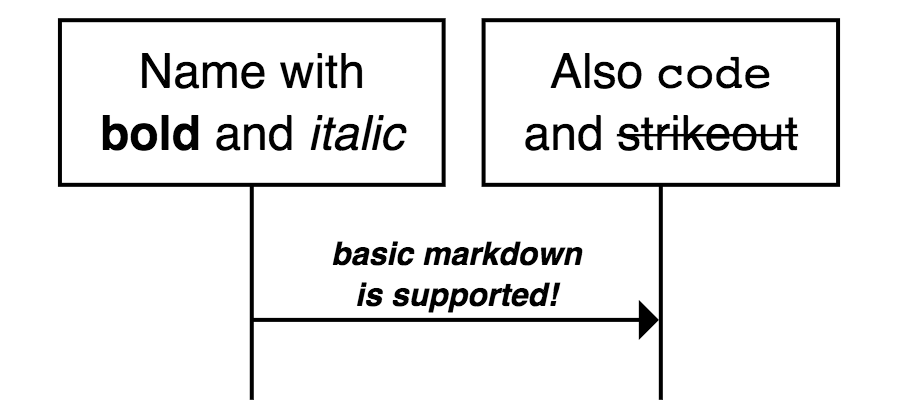

```
define "Name with
**bold** and _italic_" as A
define "Also `code`
and ~strikeout~" as B

A -> B: "_**basic markdown
is supported!**_"
```

### Alternative Agent Ordering

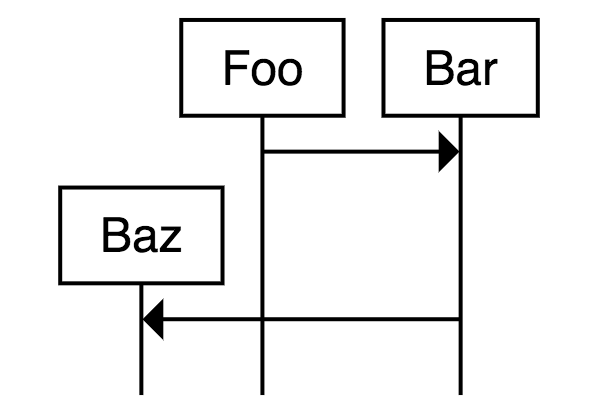

```
define Baz, Foo

Foo -> Bar
Bar -> Baz
```

### Agent Types

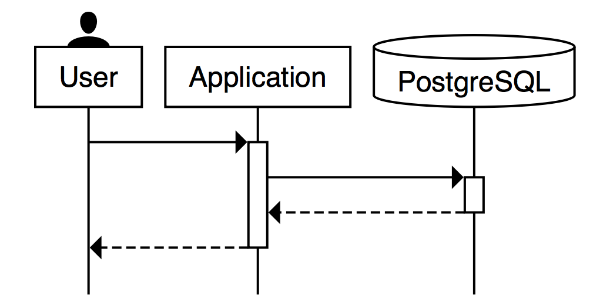

```
begin User, Application, PostgreSQL

User -> +Application
Application -> +PostgreSQL
-PostgreSQL --> Application
-Application --> User

User is a person
PostgreSQL is a database
```

### Asynchronous Communication

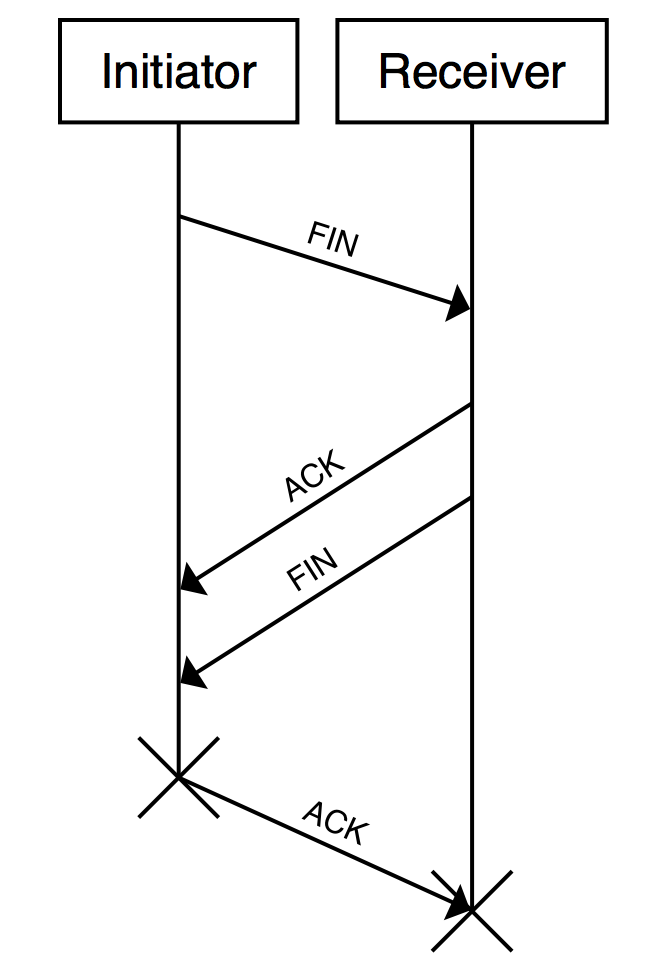

```
begin Initiator as I, Receiver as R

# the '...id' syntax allows connections
# to span multiple lines

I -> ...fin1
...fin1 -> R: FIN

# they can even inter-mix!
R -> ...ack1
R -> ...fin2
...ack1 -> I: ACK
...fin2 -> I: FIN

!I -> ...ack2
...ack2 -> !R: ACK
```

### Simultaneous Actions (Beta!)

This is a work-in-progress feature. There are situations where this can
lead to [ugly / unreadable overlapping content](https://github.com/davidje13/SequenceDiagram/issues/13).

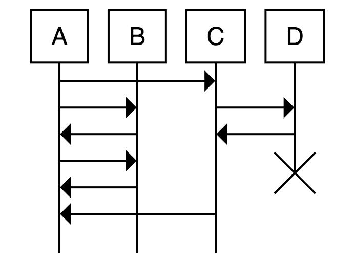

```
begin A, B, C, D
A -> C

# Define a marker which can be returned to later

some primary process:
A -> B
B -> A
A -> B
B -> A

# Return to the defined marker
# (should be interpreted as no-higher-then the marker; may be
# pushed down to keep relative action ordering consistent)

simultaneously with some primary process:
C -> D
D -> C
end D
C -> A

# The marker name is optional; using "simultaneously:" with no
# marker will jump to the top of the entire sequence.
```

## DSL Basics

Comments begin with a `#` and end at the next newline:

```
# This is a comment
```

Meta data can be provided with particular keywords:

```
title "My title here"
```

Quoting strings is usually optional, for example these are the same:

```
title "My title here"
title My title here
title "My title" here
title "My" "title" "here"
```

Each non-metadata line represents a step in the sequence, in order.

```
# Draw an arrow from agent "Foo Bar" to agent "Zig Zag" with a label:
# (implicitly creates the agents if they do not already exist)

Foo Bar -> Zig Zag: Do a thing

# With quotes, this is the same as:

"Foo Bar" -> "Zig Zag": "Do a thing"
```

Blocks surround steps, and can nest:

```
if something
  Foo -> Bar
else if something else
  Foo -> Baz
  if more stuff
    Baz -> Zig
  end
end
```

(indentation is ignored)

## Running a Server

If you want to run an online renderer (like
[https://sequence.davidje13.com/](https://sequence.davidje13.com/)),
take a look at
[ubuntu-nginx-installer.sh](docs/ubuntu-nginx-installer.sh).

## Contributing

Contributions are welcome!

If you find a bug or desire a new feature, feel free to report it in
the [GitHub issue tracker](https://github.com/davidje13/SequenceDiagram/issues),
or write the code yourself and make a pull request.

For more details on contributing, see the
[CONTRIBUTING.md file](docs/CONTRIBUTING.md).
